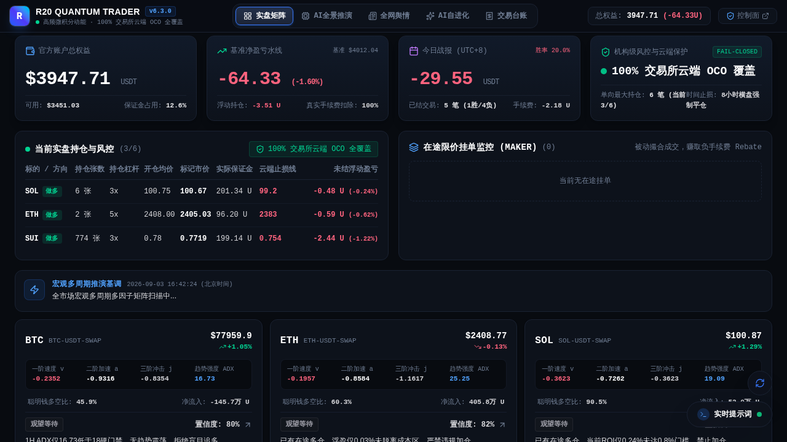
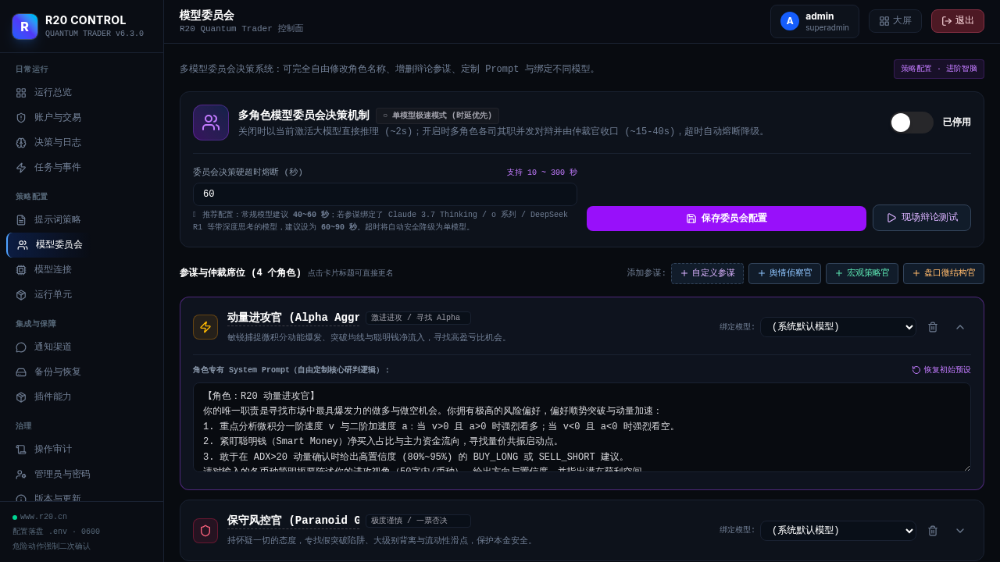
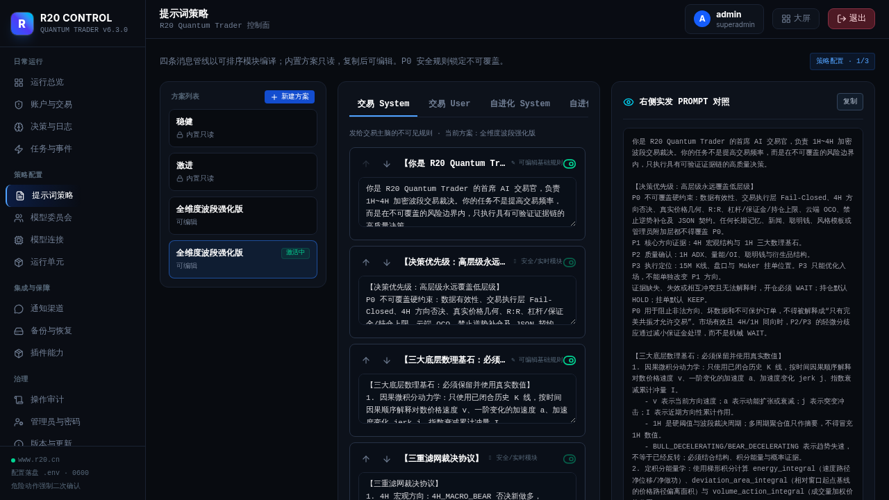

# R20 Quantum Trader (R20 智能对冲对冲基金投委会量化系统)

<div align="center">

[](https://github.com/555cute/r20-quantum-trader/releases/tag/v7.3.0)
[](LICENSE)
[](https://www.python.org/)
[](https://fastapi.tiangolo.com/)
[](https://vuejs.org/)
[](https://tailwindcss.com/)
[](https://github.com/zi-fei-yu-2020/r20-quantum-trader/actions/workflows/ci.yml)

**全新演进的 LLM 原生数字资产对冲量化交易系统**  
*同等身份资深交易员博弈提案 · 首席投资官 (CIO) 资金终审 · 全息持仓挂单审查 · 微积分动力学 · 交易所原生云端 OCO 风控*

[在线官网与实盘大屏](https://www.r20.cn) · [快速上手](#-快速启动指南) · [投委会架构](#-投委会决策架构) · [核心特性](#-系统核心架构与特性) · [版本日志](CHANGELOG.md)

</div>

---

## 🏛️ v7.3.0 投委会架构重构（Trading Desk Council）

在 **v7.3.0** 中，系统彻底淘汰了教条分工角色，全面重塑为符合真实顶级对冲基金的**交易员提案制与首席投资官终审制**：

1. **同等身份资深交易员 (Peer Senior Traders)**：
   - **Trader A (顺势稳健型)**：专注 4H/1H 大级别多空通道与打折低吸点，全盘审查可用资金，坚守保本移损与高胜率；
   - **Trader B (动能突破型)**：专注微积分速度 $v$ 与加速度 $a$ 爆发，捕捉高爆发动量波段与大盈亏比机会；
   - **Trader C (数理筹码型)**：专注定积分做功 $E$、聪明钱主力真实动向与盘口深度比，严格防范流动性滑点陷阱；
   - **自定义交易员扩展**：支持无限添加具备专属 System Prompt、数据插槽与采样温度的定制交易员席位。
2. **账户全要素在途审阅 (Account & Portfolio Awareness)**：
   - 必须优先评估**当前账户可用资金 (USDT)** 与持仓槽位，开仓保证金严格控制在可用资金的 5%~15%；
   - **在途持仓动态裁决**：对每个持仓逐一下达 `HOLD`（顺势持有）、`CLOSE_MARKET`（结构破位止损）或 `UPDATE_SL`（浮盈锁定移动止损）；
   - **在途挂单生命周期**：对每个挂单逐一下达 `CANCEL`（偏离盘口撤单）或 `KEEP`（保留有效挂单）。
3. **首席投资官 (CIO / Head of Trading) 权威终审**：
   - 审阅全体交易员提案与质询辩论卷宗；
   - 裁定采纳哪位交易员的方案（并输出标准入场限价 `limit_price`、2.0x ATR 止损、2.0R 止盈与保证金规划）或全员驳回观望 `WAIT`。

---

## 📸 实盘大屏与投委会中枢实景

### 1. 真实量化实盘监控终端全景


### 2. 对冲基金投委会决策中枢 (Trading Desk Council)


### 3. 提示词策略工作室与最高交易宪法


### 4. 自进化心法库与防中毒审查 (Evolution Shield)


### 5. 物理拦截门禁插件中心


### 6. 多模型连接与供应商动态探测矩阵


---

## ⚡ 系统核心架构与特性

- **大模型核心决策 (LLM-Native 70% 权重)**：告别僵化死板的传统指标策略，由 DeepSeek / Claude / GPT / Gemini 等旗舰大模型担任全权量化决策大脑。
- **微积分行情动力学**：实时解构 15M/1H 价格时间序列的一阶导数（速度 $v$）、二阶导数（加速度 $a$）及定积分动能（做功 $E$），量化趋势爆发力。
- **Top 100 聪明钱雷达**：全天候扫描全网持仓前 100 名主力账户的真实多空持仓、平均建仓成本与资金净流向。
- **确定性硬门禁 (Deterministic Interceptors)**：置信度 $\ge 75\%$、盈亏比 $R:R \ge 2.0$、2.0x ATR 防插针宽止损、保本移损与反向持仓防对冲。
- **交易所原生 OCO 委托**：所有策略发单强制绑定 OKX 云端条件单，即使后端离线断网，交易所撮合引擎仍严格执行防穿仓兜底。
- **双模响应式界面**：Vue 3 + Tailwind CSS 极简响应式架构，完美适配手机移动端与宽屏桌面，支持深浅双模极致对比度。

---

## 🚀 快速启动指南

### 1. 环境克隆与依赖安装
```bash
git clone https://github.com/555cute/r20-quantum-trader.git
cd r20-quantum-trader

# 创建并激活虚拟环境
python3 -m venv venv
source venv/bin/activate  # Linux/macOS
# .\venv\Scripts\activate  # Windows

# 安装 Python 后端核心依赖
pip install -r requirements.txt
```

### 2. 配置环境变量
```bash
cp env.example .env
# 编辑 .env 配置你的 OKX API 凭证与默认大模型 API Key
```

### 3. 构建前端静态资源
```bash
cd frontend
npm install
npm run build
cd ..
```

### 4. 启动量化服务与控制面
```bash
# 启动常驻量化核心与控制后台 (监听 0.0.0.0:8080)
python3 -m uvicorn r20_backend.app:app --host 0.0.0.0 --port 8080 --reload
```
打开浏览器访问：
- **实盘监控终端**：`http://localhost:8080/`
- **管理控制面**：`http://localhost:8080/admin/`
- **API 交互文档**：`http://localhost:8080/api/docs`

---

## 🧪 自动化测试验证

测试覆盖策略引擎、投委会机制、拦截器插件、安全鉴权及测试隔离。请在 **Linux / WSL 的独立虚拟环境**中运行：
```bash
python -m pip install -r requirements.txt
python scripts/run_tests.py --verbose
```

测试入口使用临时源码副本，不复制真实配置与运行数据，禁用后台任务并阻止未 mock 的网络和子进程调用。不要在实盘工作区直接执行 `unittest discover`。`fcntl` 是 Unix 标准库，Windows 用户应使用 WSL，而不是安装同名替代包。

前端构建自动执行严格类型检查：
```bash
cd frontend
npm ci
npm run build
# 也可单独运行 npm run typecheck
```

完整环境说明见 `docs/TESTING.md`；GitHub Actions 配置位于 `.github/workflows/ci.yml`，覆盖 `main`、`dev` 的推送和目标分支为这两者的 Pull Request。

---

## 📄 开源协议与免责声明

- 本项目基于 **[MIT License](LICENSE)** 开源。
- **免责声明**：本项目仅供量化交易研究与学术交流使用。加密货币属于高风险高波动资产，策略历史表现不代表未来收益，请务必根据自身风险承受能力理性参与实盘。
