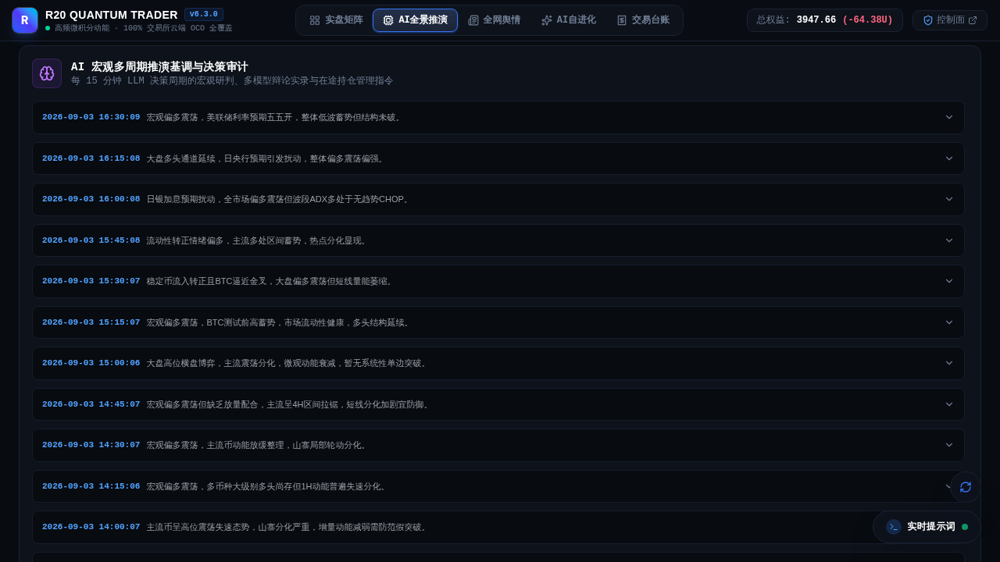
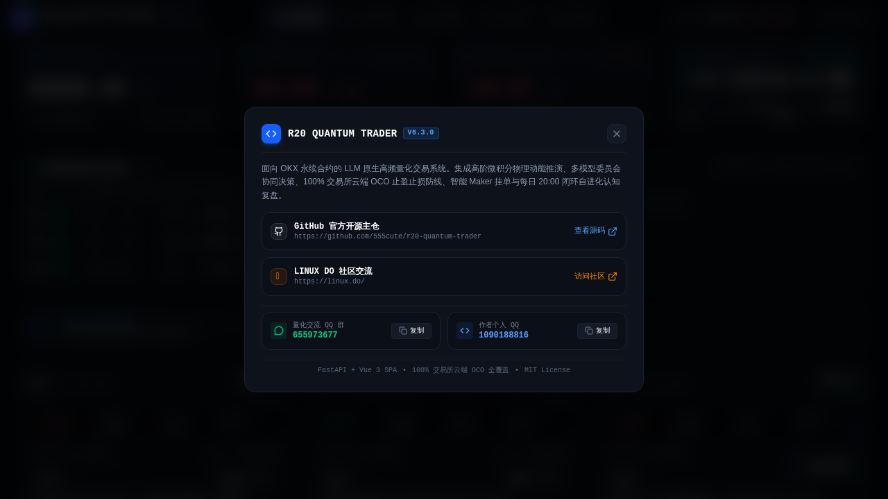

<div align="center">

# R20 Quantum Trader

### 面向 OKX 永续合约的 LLM 原生量化交易系统

**独立 Gateway · 多模型委员会 · 模块化提示词 · 原生 Vue 3 SPA · QQ 官方 Bot 扫码 · 100% 云端 OCO · 加密灾备**

[](https://github.com/555cute/r20-quantum-trader/releases/tag/v6.3.0)
[](#-社区与致谢)
[](https://linux.do/)
[](https://www.python.org/)
[](https://www.okx.com/)
[](#-验证与测试)
[](LICENSE)

[🌐 在线实盘大屏](https://www.r20.cn/) · [🚀 独立部署指南](STANDALONE.md) · [📦 灾备恢复](RECOVERY_GUIDE.md) · [🐧 LINUX DO 社区](https://linux.do/)

<br/>

> 💬 **QQ 官方交流群**：**`655973677`** ｜ **作者 QQ**：`1090188816` ｜ 欢迎进群交流策略调优与实盘动态！

</div>

---


> [!WARNING]
> R20 是研究型自动化量化交易开源项目，不构成任何投资建议，亦不承诺任何收益。强烈建议在 OKX **DEMO 模拟盘** 环境下完成策略验证、风控测试、QQ 扫码通知与灾备演练后，再评估是否接入实盘。

---

## 📸 产品界面展示

### 1. 机构级实盘矩阵大屏（Vue 3 原生 SPA）
*全新 53px 单行沉浸顶栏、四大资产风控 HUD 核心指标卡、当前实盘持仓明细（保证金与实际强平线）、在途限价挂单监控（Maker 负费率）与底部 2160px 超宽屏六币微积分动力学矩阵一览无余。*


### 2. 🏛️ 多模型委员会决策系统（Multi-Agent Council · 核心重磅）
*告别单一模型决策偏差！支持多参谋多线程并发辩论博弈：**动量进攻官**（寻找 Alpha 突破）、**保守风控官**（量价背离与一票否决权）、**量化数理官**（ADX/CMF 纯数学门禁）、**舆情侦察官**、**宏观策略官**与**微结构官**各司其职，最终由**首席终审仲裁官**权衡收口，严格输出标准化交易发单契约。支持席位全动态 CRUD、独立模型绑定与现场沙箱辩论测试。*


### 3. ⌘ 模块化提示词策略工作室（Prompt Studio · 核心亮点）
*拒绝死板黑盒！支持内置只读稳健方案、激进方案与用户自定义方案热切换；覆盖交易主脑与自进化引擎的 4 条消息管线（System/User），支持模块自由增删、拖拽排序、正文热修、P0 核心约束锁定，并在右侧毫秒级编译拼装生成当期实发 Prompt 原文对照。*


### 4. 🧠 AI 宏观推演全景与决策审计时间线
*前台专享「AI全景推演」工作台，按时间轴完整回溯每 15 分钟交易周期的全网宏观研判、多周期结构共振、以及委员会参谋当时的对决争辩与终审裁决纪要。*



### 5. 🐧 开源主仓与社区交流弹窗
*前台顶栏版本号、底部页脚与后台侧栏均支持一键唤起社区弹窗，直达 GitHub 官方开源主仓、LINUX DO 社区交流，并提供量化交流群（655973677）与作者个人 QQ（1090188816）一键快捷复制。*



---

## 🛠️ 核心能力概览

| 模块维度 | 当前特性与规格 |
|---|---|
| **交易标的** | 默认覆盖 BTC、ETH、SOL、DOGE、SUI、LINK 六大主流高流动性合约，支持后台动态增删 |
| **议会决策中枢** | **Multi-Agent Council 多参谋博弈体系**：进攻、风控、数理、舆情、宏观、盘口参谋并发激辩，仲裁官统一契约收口 |
| **提示词工程** | **模块化策略工作室**：4 条消息管线模块化拖拽、P0 级 Fail-Closed 硬防护、实发 Prompt 毫秒级预览 |
| **数理基石** | 因果微积分动力学（速度 $v$、加速度 $a$、冲量 $I$、加加速度 $j$）、定积分能量学（做功 $E$、偏离面积 $A$）、VaR 概率模型 |
| **聪明钱透视** | OKX Top100 实盘主力加权多空占比、主力资金净流向、多头均价、空头均价与多空胜率 |
| **大模型大脑** | 统一执行器全面适配 **OpenAI Chat**、**OpenAI Responses** 与 **Claude Messages** 三大协议；原生支持 o系列 / Gemini / DeepSeek 深度长思考链 |
| **交易执行层** | OKX V5 原生直签、Maker 限价低费率挂单、动态撤单重挂、**100% 交易所云端 OCO 双向止盈止损**全覆盖 |
| **多通道通知** | **QQ 官方 Bot（长连接守护 + 手机扫码自动捕获 OpenID）**、企业微信机器人、Telegram Bot（支持反代 BaseURL）、通用 Webhook（智能指纹识别） |
| **多后端灾备** | Kopia 极简设计、scrypt + AES-256-GCM 强加密、定时自动快照、清单校验与 0 磁盘占用异地归档 |
| **前端技术栈** | **Vue 3 + Vite + Pinia + Tailwind CSS 纯静态 SPA**，首屏毫秒级直出，**0 Node.js 常驻进程负担** |

---

## 🚀 极速部署指南

### 1. 克隆代码仓库

```bash
git clone https://github.com/555cute/r20-quantum-trader.git
cd r20-quantum-trader
```

### 2. 运行自动化部署脚本

```bash
# 推荐一键部署：自动配置 Python 虚拟环境与依赖
./deploy/install.sh
```

或手动执行：

```bash
python3 -m venv .venv
source .venv/bin/activate
pip install -r requirements.txt
```

### Docker Compose 部署

如果希望使用 Docker 部署，请先阅读 [Docker 部署指南](docs/DOCKER.md)，然后执行：

```bash
cp env.example .env
chmod 600 .env
docker compose -f compose.yaml build
docker compose -f compose.yaml up -d
```

Docker 方案使用单个应用容器：FastAPI 会负责启动 Gateway Supervisor 和 Gateway Worker；不要额外启动旧版 `r20_backend.scheduler`，以免重复调度。运行数据、日志、备份、加密配置和可选的 OKX OAuth 状态都保存在 Docker named volumes 中。
### 3. 环境变量配置

```bash
cp env.example .env
chmod 600 .env
```

配置核心参数：

```dotenv
# 大模型推演连接 (支持 OpenAI Chat / OpenAI Responses / Claude Messages)
LLM_BASE_URL=https://api.openai.com/v1
LLM_API_KEY=your_llm_api_key
LLM_MODEL=gemini-3.8-flash-high
LLM_REASONING_EFFORT=high

# 交易所环境选择 (demo 模拟盘 / live 实盘)
R20_OKX_ENV=demo
OKX_DEMO_API_KEY=
OKX_DEMO_SECRET_KEY=
OKX_DEMO_PASSPHRASE=

# 超级管理员初始化 Token
R20_SETUP_TOKEN=your_secure_random_token
```

### 4. 启动系统

```bash
# 启动统一管理后端与监控大屏
python3 -m uvicorn r20_backend.app:app --host 0.0.0.0 --port 8080
```

- 🌐 **前台大屏**：`http://localhost:8080/`
- 🎛️ **后台管理**：`http://localhost:8080/admin`

---

## 🧪 验证与测试

系统内置完善的单元测试与回归测试套件，全面覆盖数理微积分、OKX 签名与交易服务、QQ 网关长连接与扫码加密解密、提示词管线、模型委员会多线程调度与后台 API 鉴权：

```bash
# 运行全量 154 项自动化测试
python3 -m unittest discover -s tests
```

```text
----------------------------------------------------------------------
Ran 154 tests in 30.41s

OK
```

---

## 🤝 社区与致谢

- **🐧 LINUX DO 社区**：[linux.do](https://linux.do/)（感谢社区各位佬友的大力支持与开源认可！）
- **💬 QQ 官方交流群**：`655973677`
- **👨‍💻 作者 QQ**：`1090188816`
- **🐛 问题反馈**：[GitHub Issues](https://github.com/555cute/r20-quantum-trader/issues)

---

## 📄 开源许可证

本项目基于 [MIT License](LICENSE) 协议开源。
